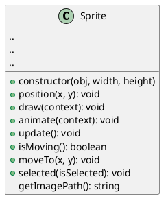

# Candy Crush

```plantuml
@startuml

class Sprite {

    ..
    + constructor(obj, width, height)
    ..
    + position(x, y): void
    + draw(context): void 
    + animate(context): void
    + update(): void
    + isMoving(): boolean
    + moveTo(x, y): void
    + selected(isSelected): void
    ..
    getImagePath(): string
}

@enduml
```