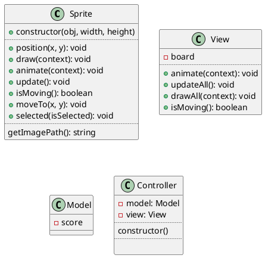

# Candy Crush

```plantuml
@startuml

class Sprite {
    + constructor(obj, width, height)
    ..
    + position(x, y): void
    + draw(context): void 
    + animate(context): void
    + update(): void
    + isMoving(): boolean
    + moveTo(x, y): void
    + selected(isSelected): void
    ..
    getImagePath(): string
}

class View {
    - board
    ..
    + animate(context): void
    + updateAll(): void
    + drawAll(context): void 
    + isMoving(): boolean
}

class Model {
    - score
}

class Controller {
    - model: Model
    - view: View
    ..
    constructor()
    ..
    
}

@enduml
```